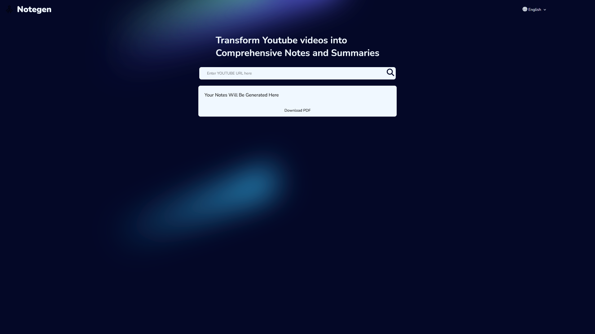

# Notegen

A powerful FastAPI application that generates comprehensive notes and summaries from YouTube videos, with support for multiple languages and PDF export.



*Transform YouTube videos into comprehensive notes and summaries with a beautiful, modern interface*

## Features

- 📝 Generate notes and summaries from YouTube videos
- 🌐 Multi-language support (English, Hindi, Gujarati)
- 📄 PDF export with proper formatting
- 🎯 Smart text extraction:
  - Uses YouTube captions when available
  - Falls back to audio transcription when captions aren't available
- 💫 Advanced formatting in generated PDFs:
  - Bullet points
  - Bold text
  - Proper paragraph spacing
  - Unicode support for multiple languages
- 🚀 Performance optimized:
  - Caches results for faster repeated access
  - Automatic cleanup of temporary files
  - Smart font downloading and caching

## Setup

1. Clone the repository:
```bash
git clone https://github.com/yourusername/notegen.git
cd notegen
```

2. Create a virtual environment and install dependencies:
```bash
python -m venv .venv
source .venv/bin/activate  # On Windows: .venv\Scripts\activate
pip install -r requirements.txt
```

3. Create a `.env` file with your API keys:
```env
GEMINI_API_KEY=your_gemini_api_key
```

4. Run the application:
```bash
python main.py
```

The server will start at `http://localhost:8000`

## API Endpoints

### 1. Generate Notes
```http
GET /yt
```

Parameters:
- `url` (required): YouTube video URL
- `language` (optional): Output language (default: "english")
  - Supported: "english", "hindi", "gujarati"
- `task` (optional): Type of output (default: "notes")
- `prompt` (optional): Custom prompt for generation

Example:
```bash
curl "http://localhost:8000/yt?url=https://youtube.com/watch?v=VIDEO_ID&language=english"
```

### 2. Download PDF
```http
GET /download_pdf
```

Parameters:
- `url` (required): YouTube video URL

Example:
```bash
curl "http://localhost:8000/download_pdf?url=https://youtube.com/watch?v=VIDEO_ID" --output notes.pdf
```

## Frontend Usage

The application includes a web interface accessible at `http://localhost:8000`:

1. Enter a YouTube URL in the input field
2. Select your preferred language from the dropdown
3. Click the search icon or press Enter to generate notes
4. Use the "Download PDF" button to get a formatted PDF version

## Docker Support

Build and run with Docker:

```bash
# Build the image
docker build -t notegen .

# Run the container
docker run -p 8000:8000 notegen
```

Or use Docker Compose:

```bash
docker-compose up
```

## Deployment

The application is ready for deployment on Vercel:

1. Fork this repository
2. Connect your fork to Vercel
3. Add your environment variables in Vercel's dashboard
4. Deploy!

## Technical Details

- Uses Google's Gemini AI for text generation
- Supports YouTube caption extraction and audio transcription
- PDF generation with ReportLab
- Automatic font downloading for multi-language support
- Result caching for improved performance
- Built with FastAPI for high performance
- Frontend built with vanilla JavaScript for simplicity

## Limitations

- YouTube videos must be public or unlisted
- Maximum video length depends on available resources
- Some languages might require additional font downloads
- PDF generation might vary slightly between languages

## Contributing

Contributions are welcome! Please feel free to submit a Pull Request.

## License

This project is licensed under the MIT License - see the LICENSE file for details.
